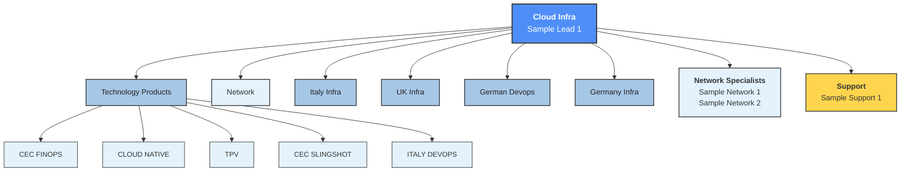

```mermaid

flowchart TD
	InfraLead["<b>Cloud Infra</b><br>Sample Lead 1"]:::lead
	TechProducts["Technology Products"]:::engineer
	Network["Network"]:::network
	ItalyInfra["Italy Infra"]:::engineer
	UKInfra["UK Infra"]:::engineer
	GermanDevops["German Devops"]:::engineer
	GermanyInfra["Germany Infra"]:::engineer

	CEC_FINOPS["CEC FINOPS"]:::subteam
	CLOUD_NATIVE["CLOUD NATIVE"]:::subteam
	TPV["TPV"]:::subteam
	CEC_SLINGSHOT["CEC SLINGSHOT"]:::subteam
	ITALY_DEVOPS["ITALY DEVOPS"]:::subteam

	InfraLead --> TechProducts
	InfraLead --> Network
	InfraLead --> ItalyInfra
	InfraLead --> UKInfra
	InfraLead --> GermanDevops
	InfraLead --> GermanyInfra
	InfraLead --> NetSpec
	InfraLead --> Support

	TechProducts --> CEC_FINOPS
	TechProducts --> CLOUD_NATIVE
	TechProducts --> TPV
	TechProducts --> CEC_SLINGSHOT
	TechProducts --> ITALY_DEVOPS

	NetSpec["<b>Network Specialists</b><br>Sample Network 1<br>Sample Network 2"]:::network
	Support["<b>Support</b><br>Sample Support 1"]:::support

	classDef lead fill:#4F8EF7,stroke:#333,stroke-width:2px,color:#fff,font-size:16px;
	classDef engineer fill:#A7C7E7,stroke:#333,stroke-width:1.5px,color:#222,font-size:15px;
	classDef network fill:#E3F2FD,stroke:#333,stroke-width:1.5px,color:#333,font-size:15px;
	classDef support fill:#FFD54F,stroke:#333,stroke-width:1.5px,color:#333,font-size:15px;
	classDef subteam fill:#E3F2FD,stroke:#333,stroke-width:1px,color:#333,font-size:14px;

	classDef lead fill:#4F8EF7,stroke:#333,stroke-width:2px,color:#fff,font-size:16px;
	classDef engineer fill:#A7C7E7,stroke:#333,stroke-width:1.5px,color:#222,font-size:15px;
	classDef network fill:#E3F2FD,stroke:#333,stroke-width:1.5px,color:#333,font-size:15px;
	classDef support fill:#FFD54F,stroke:#333,stroke-width:1.5px,color:#333,font-size:15px;
```

<!-- Replace the sample names and roles with your actual team details as needed. -->